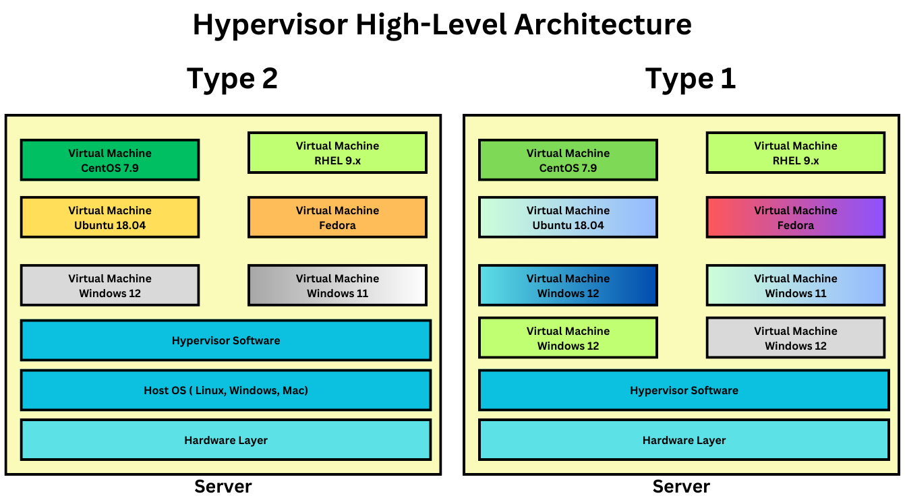

# Day 1

## First day feedback link
<pre>
https://survey.zohopublic.com/zs/WPBTLR  
</pre>  

## Boot Loaders
<pre>
- is a system utility that is installed in the hard disk boot sector( byte 0, sector 0 )
- MBR stands for Master Boot Record is where the boot loader application is installed
- it is 512 bytes
- boot loader application is the first application that runs after the BIOS POST (Power On Self Test)
- the boot loader application searches your hard disk, looking for Operating Systems installed on it
- in case, the boot loader finds more than one OS then it gives a menu for the user to choose which OS they want to boot into
- in otherwords, though many OS is installed in the systemm the boot loader allows only OS to be active at any point of time
</pre>  

## Hypervisor Overview
<pre>
- Hypervisor a.k.a Virtualization
- virtualization technology allows us to run multiple OS in the same laptop/desktop/server
- i.e many OS can be active at the same time in the same machine
- there are 2 types of Hypervisors
  1. Type 1 - Bare Metal Hypervisor ( used in Workstations and Servers )
  2. Type 2 - used in laptops/desktops/workstations
- this type of virtualization is called Heavy-weight
  - the reason is,each virtual machine requires dedicated hardware resources
    - dedicated CPU cores
    - dedicated RAM
    - dedicated Storage ( HDD/SSD )
- the OS runs within the Virtual Machine(VM/Guest OS), hence each VM represents one OS
- the OS that runs within the VM is a fully functional OS
</pre>

#### Type 1 - Bare Metal Hypervisor
<pre>
- Virtual Machine can be created directly on the server without any Host OS
- Examples
  - VMWare vsphere/vcenter
</pre>

#### Type 2 Hypervisor
<pre>
- Examples
  - VMWare
    - Fusion ( supports Mac OS-X )
    - Workstation ( supports Linux and Windows )
  - Oracle VirtualBox
  - Parallels ( supports Mac OS-X )
  - Microsoft Hyper-V
  - KVM - supported in all Linux distibutions
</pre>


## Server Grade Processor
- it supports 128,256,512 cpu cores
- Motherboards with 8 Processor Sockets
- Processors also come in 2 types of packaging
  - SCM ( single chip module )
  - MCM ( multiple chip module )


## Minimal number of Physical server to support 1000 Virtual Machines
- assume the server motherboards supports 8 Processor Sockets
- if we install MCM based Processor, i.e each IC has 4 Processor, each Processor supporting 256 cores
- total number of Physical CPU cores - 8 x 4 x 256 = 8192
- total logical/virtual CPU cores - 8192 x 2 = 16384

## Hypervisor High Level Architecture


## Linux Kernel that supports containerization
<pre>
1. Namespace - isolating one container from other containers
2. Control Groups ( CGroups ) 
   - helps in applying resource quoto restrictions to individual containers
   - we can restrict,how much maximum RAM a container can utilize 
   - we can restrict, how many CPU cores a container can utilize
</pre>  

## Containerization
<pre>
- is an application virtualization technology
- light-weight virtualization
  - each containized application doesn't require dedicated hardware resources
  - all containers that runs in a machine shares the Hardware resources available in the underlying OS
- each container represents a single application
- each container get an IP address
- each container get its own file system
- container is an application process that runs in a separate namespace
- containers are not a replacement for Virtualization or OS
- containers and virtualization are complementing technology, hence they are used in combination in real world
- each container get its own dedicated network namespace
- each container get its own dedicated network stack ( 7 OSI Layers )
- each container get its own dedicated port range ( 0 - 65535 )
- most of the containers has atleast one network card (virtual network card)
</pre>

## Container Engine Overview
<pre>
- is a high-level software that helps u managing container images and containers
- user-friendly 
- under the hood, container engines depends on Container runtimes to manage images and containers
- Examples
  - Docker is a Container Engine that depends on containerd which in turn depends on runC container runtime
  - Podman is a Container Engine that depends on CRI-O container runtime
</pre>

## Container Runtime Overview
<pre>
- is low-level software utility that helps us managing container images and containers  
- they are not user-friendly, hence normal end-users avoid using them directly
- examples
  - runC container runtime
  - CRI-O container runtime
</pre>

## Docker Overview
<pre>
- Docker is develed in go language by a company called Docker Inc
- a container engine that depends on containerd
- containerd in turn depends on runC container runtime
- a very popular container engine
- off late, due to security vulnerabilities the industry is moving away from Docker
- some alternates to docker is containerd, podman, etc
- it comes in 2 flavours
  - Docker Community Edition - Docker CE ( open source )
  - Docker Enterprise Edition - Docker EE ( Paid version )
</pre>

## Docker High Level Architecture


## Lab - Checking docker version and information
```
docker --version
docker info
```

Expected output


## Lab - Listing docker images in your local docker registry
```
docker images
```

Expected output


## Lab - Create a container and run it in background

Create and run the container in the background(as a daemon)
```
docker run -dit --name ubuntu-jegan --hostname ubuntu-jegan ubuntu:24.04 /bin/bash
```
In the above command
<pre>
dit - stands for detached interactive terminal
name - unique name of the container, replace 'jegan' with your name
hostname - though name and hostname can be different, as a best practice make sure they are same to avoid confusion
ubuntu:24.04 - docker image name
/bin/bash - application that you wish to run inside the container
</pre>

List all the running contianers
```
docker ps
```

Expected output


## Lab - Listing all containers including the exited ones

Stopping a running container
```
docker stop ubuntu-jegan
```

List all containers 
```
docker ps -a
```

Expected output


## Lab - Starting an exited container
```
docker ps -a
docker start ubuntu-jegan
docker ps
```

Expected output


## Lab - Restart a running container
```
docker ps
docker restart ubuntu-jegan
docker ps
```

Expected output


## Lab - Finding more details about a docker image
```
docker images
docker image ubuntu:24.04
```

Expected output


## Lab - Creating a custom Docker Image
Create a file named Dockerfile with the below content
```
FROM ubuntu:24.04
RUN apt update && apt install -y iputils-ping net-tools
```

Build a custom docker image
```
docker build -t tektutor/ubuntu:24.04 .
docker images
```

Expected output


Delete the existing container
```
docker rm -f ubuntu-jegan
docker ps -a
```

Create a container using our custom docker image
```
docker run -dit --name ubuntu-jegan --hostname ubuntu-jegan tektutor/ubuntu:24.04 /bin/bash
docker ps
docker exec -it ubuntu-jegan bash
ping -c 2 8.8.8.8
ifconfig
exit
```

Expected output


## Lab - another example of custom docker image
Create a Dockerfile with below content
```
FROM ubuntu:24.04
RUN apt update && apt install -y iputils-ping net-tools
RUN apt update && apt install -y default-jdk maven
```

Build the custom image
```
docker build -t tektutor/ubuntu:2.0 .
docker images
```

Create a container using custom image
```
docker run -dit --name c1-jegan --hostname c1-jegan tektutor/ubuntu:2.0 bash
docker ps
docker exec -it c1-jegan bash
mvn --version
exit
```

Expected output


## Lab - Find IP address of a container
```
docker ps
docker inspect c1-jegan | grep IPA
docker inspect -f {{.NetworkSettings.IPAddress} c1-jegan
```

Expected output


## Lab - Deleteing a docker image from local registry
```
docker pull hello-world:latest
docker images
docker rmi hello-world:latest
docker images
```

Expected output


## Lab - Deleting a running container
```
docker ps
docker rm -f ubuntu-jegan
docker ps -a
```

Expected output


## Lab - Port forward to expose a containerized application for external access
```
docker run -d --name nginx1-jegan -p 8001:80 nginx:latest
docker run -d --name nginx2-jegan -p 8002:80 nginx:latest
docker ps
```

Accessing the nginx web page from external machine
```
http://10.0.1.13:8001
http://10.0.1.13:8002
```

In the above url, 10.0.1.13 is the IP address of server1 linux machine, any request received at port 8001 will be forwarded to nginx1-jegan container at port 80

Expected output


## Lab - Checking containerized application logs
```
docker ps | grep jegan
docker logs nginx1-jegan
```

Expected output


## Lab - Deleting multiple containers with single docker command
```
docker ps | grep jegan
docker rm -f nginx1-jegan nginx2-jegan c3-jegan c2-jegan c1-jegan
docker rm -f $(docker ps -aq -f "name=jegan")
```

Expected output


## Lab - Setup a load balancer using nginx 
Let's create 3 nginx web servers without port forwarding
```
docker run -d --name web1-jegan nginx:latest
docker run -d --name web2-jegan nginx:latest
docker run -d --name web3-jegan nginx:latest
docker ps -f "name=jegan"
```

Expected output


Let's create a load balancer container using nginx with port forwarding to make accessible from external machines
```
docker run -d --name lb-jegan -p 80:80 nginx:latest
docker ps -f "name=jegan"
```

Let's copy the nginx.conf file from lb-jegan container to local system
```
docker cp lb-jegan:/etc/nginx/nginx.conf .
```

Let's modify the http block as shown below nginx.conf on our local machine as shown below
```

http {
    upstream backend {
        server 172.17.0.2:80;
        server 172.17.0.7:80;
        server 172.17.0.9:80;
    }

    server {
        location / {
            proxy_pass http://backend;
        }
    }
}
```

We need to copy the modify nginx.conf file back in to the lb container
```
docker cp nginx.conf lb-jegan:/etc/nginx/nginx.conf
```

We need to restart the lb container to apply config changes
```
docker restart lb-jegan
```

We need to check if the nginx container continues to run after config changes
```
docker ps
```

Let's customize the web1-jegan, web2-jegan and web3-jegan container pages
```
echo "Server 1" > index.html
docker cp index.html web1-jegan/usr/share/nginx/html/index.html

echo "Server 2" > index.html
docker cp index.html web2-jegan/usr/share/nginx/html/index.html

echo "Server 3" > index.html
docker cp index.html web3-jegan/usr/share/nginx/html/index.html
```

Let's check if load balancer is routing the calls in round-robin fashion from the web browser
```
http://localhost:80
http://10.0.1.13
```

Expected output


## Lab - Renaming containers
```
docker ps -f "name=jegan"
docker rename web1-jegan c1-jegan
docker rename web2-jegan c2-jegan
docker rename web3-jegan c3-jegan
docker ps -f "name=jegan"
```

Expected output


## Lab - Creating a container in foreground(interactive) mode
```
docker run -it --name ubuntu-jegan ubuntu:24.04 bash
hostname
hostname -i
exit
```

Expected output


## Lab - Creating mysql server container
```
docker run -d --name mysql-jegan --hostname mysql-jegan -e MYSQL_ROOT_PASSWORD=root@123 mysql:latest
docker ps -f "name=mysql-jegan"
docker exec -it mysql-jegan sh
mysql -u root -p
SHOW DATABASES;
CREATE DATABASE tektutor;
USE tektutor;
CREATE TABLE trainings ( id INT NOT NULL, name VARCHAR(100) NOT NULL, duration VARCHAR(50) NOT NULL, PRIMARY KEY(id) );
INSERT INTO trainings VALUES ( 1, "DevOps", "5 Days" );
INSERT INTO trainings VALUES ( 2, "Openshift", "5 Days" );
SELECT * FROM trainings;
exit
exit
```

Expected output


Let's delete the mysql container
```
docker rm -f mysql-jegan
docker ps -a
```

Let's create a folder in our local linux server
```
mkdir -p /tmp/mysql-jegan
```

Let's mount the above path inside the container using volume mounting to force the container store the data in an external storage
```
docker run -d --name mysql-jegan --hostname mysql-jegan -e MYSQL_ROOT_PASSWORD=root@123 -v /tmp/mysql-jegan:/var/lib/mysql mysql:latest
docker ps
docker exec -it mysql-jegan sh
mysql -u root -p
SHOW DATABASES;
CREATE DATABASE tektutor;
USE tektutor;
CREATE TABLE trainings ( id INT NOT NULL, name VARCHAR(100) NOT NULL, duration VARCHAR(50) NOT NULL, PRIMARY KEY(id) );
INSERT INTO trainings VALUES ( 1, "DevOps", "5 Days" );
INSERT INTO trainings VALUES ( 2, "Openshift", "5 Days" );
SELECT * FROM trainings;
exit
exit
```

Let's delete the mysql-jegan container
```
docker rm -f mysql-jegan
```

Let's recreate a new container using the same local disk path
```
docker run -d --name mysql-jegan --hostname mysql-jegan -e MYSQL_ROOT_PASSWORD=root@123 -v /tmp/mysql-jegan:/var/lib/mysql mysql:latest
docker ps
docker exec -it mysql-jegan sh
mysql -u root -p
SHOW DATABASES;
USE tektutor;
SHOW TABLES
SELECT * FROM trainings;
exit
exit
```

As you noticed, the data is intact even though we delete the original container that created those records.


Expected output


