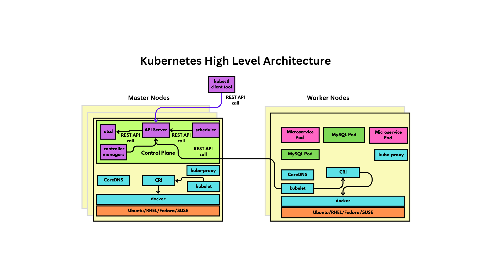
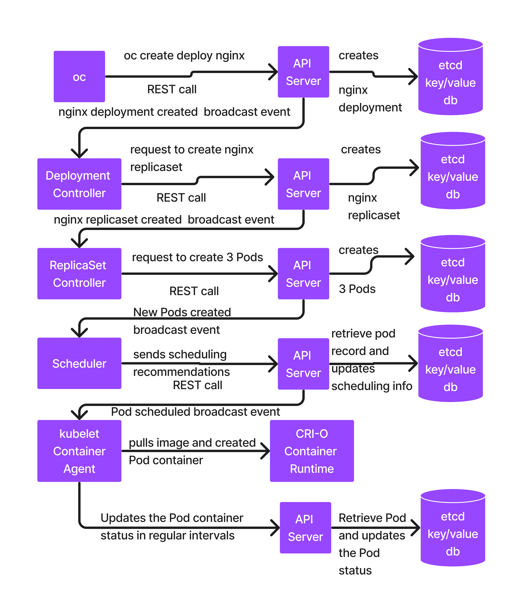

# Day 2

## Info - Container Orchestration Platform Overview
<pre>
- Container Orchestration Platforms supports the below features  
  - deploying containerized application workloads
  - scale up/down based on user-traffic to our applications
  - provides an environment to make our applications highly available(HA)
  - load-balancing
  - monitoring tools
  - rolling update
    - upgrading your live application from one version to the other without any downtime
  - rollback
    - rolling back to previous to older versions when the new version is found to be unstable
  - exposing application for internal or external use via services
  - supports service discovery - i.e services can be accessed using their name 
- examples
  - Docker SWARM
  - Google Kubernetes
  - Opensource Openshift (OKD)
  - Red Hat Openshift
  - EKS - AWS Managed Kubernetes Service 
  - AKS - Azure Kubernetes Service
  - ROSA - AWS Managed Openshift Service
  - ARO - Azure Managed Openshift Service
</pre>

## Info - Docker SWARM
<pre>
- Docker SWARM is a Container Orchestration Platform developed by Docker Inc as a open source project
- it is Docker's native Container Orchestration Platform
- it only support Docker containerized application workloads
- it is very light-weight, easy to setup, easy to learn and easy to maintain
- it is not production grade
- it is very good for learning or dev/qa environment or for R&D purpose
</pre>

## Info - Kubernetes Overview
<pre>
- Container Orchestration Platform developed by Google 
- Google used this product internally for several years before they made it opensource
- it is time-tested, robus Container Orchestration Platform thats works for simple or very complex applications
- ideal for dev/qa/prod 
- supports many different container runtimes and engines 
- it is an opensource project that can be used free of cost for personal and commercial use
- supports only command-line, setup can only be done in Linux
- we don't get support from Google as it is opensource project
- however, we can get support from Google if we use GKE from Google cloud
- however, we can get support from Amazon if we use EKS from AWS cloud
- however, we can get support from Microsoft if we use AKS from Azure cloud  
</pre>

## Info - OKD
<pre>
- opensource OpenShift Container Orchestration Platform
- supports CRI-O container runtime and Podman Container Engine only
- supports CLI and webconsole
- supports user management
- developed on top of Kubernetes with many addition features
- it is a superset of Google Kubernetes
- you won't get support from any specific company as it is open source, you are on your own, you only get community support
</pre>

## Info - Red Hat Openshift
<pre>
- it is commercial Container Orchestration Platform developed by Red Hat
- developed on top of opensource OKD
- supports CLI and Webconsole
- we will get support from Red Hat ( an IBM company )
</pre>

## Info - Kubernetes High Level Architecture



## Info - Kubernetes Control Plane
<pre>
- Control Plane Components only run in master nodes
- below are the Control Plane Components
  1. API Server
  2. etcd database
  3. scheduler
  4. Controller Managers
</pre>

#### Info - API Server
<pre>
- is the heart of Kubernetes - Container Orchestration Platform  
- it supports REST API for all Kubernetes features
- API Server is the only components that has write access to etcd database
- API Server saves and manages the cluster and application status in the etcd database
- every API Server has its own dedicated etcd database
- Whenever new records are added, edited, deleted in the etcd database, API Server will send broadcasting events about the change
</pre>

#### Info - etcd
<pre>
- it is key/value database
- it is an independent opensource database that is developed and maintained independent of Kubernetes/Openshift
- distributed database that can be used even outside the scope of Kubernetes/Openshift
</pre>

#### Info - scheduler
<pre>
- this component is responsible to schedule containerized application loads onto healthy nodes within the Kubernetes cluster
- when we deploy our application into Kubernetes(k8s), it creates Pods, within Pods containers are created, our application runs inside one of those containers
- the scheduler decides on which Pod goes into which node ( master-1, master-2, master-3, worker-1, worker-2, worker-3 )
- however, it won't schedule the Pods on its own, it is send the scheduling recommendations to API Server via REST calls
</pre>

#### Info - Controller Managers
<pre>
- Controller Managers is combination of many Controllers
- monitoring feature and self-healing property are supported by Controllers to our containerized applications
- For example
  - Deployment Controller
  - ReplicaSet Controller
  - DaemonSet Controller
  - Endpoint Controller
  - Storage Controller
  - Job Controller
  - CronJob Controller
- Controller is special type of application that has unrestricted access to all namespaces(projects) within Kubernetes
- Each Controller monitors one type of Kubernetes Resource
- For example
  - Deployment Controller Manages ReplicaSet
  - ReplicaSet Controller Manages Pods
</pre>

## Pod Overview
<pre>
- literal english - a group of whales is called a Pod
- it is a JSON file that is stored in etcd database
- docker logo is whale, that's how the Pod terminology was coined
- is a group of related containers
- a Kubernetes resource which is defined as JSON document
- Pod definition is stored in etcd and maintained by API Server
</pre>


## ReplicaSet Overview
<pre>
- is a Kubernetes resource, that resides in etcd database
- it is a JSON file that is stored in etcd database
- it captures the below details
  - container image that must be used while deploying the application containers
  - desired number of Pod instances that must be running
  - actual number of Pod instances that are running
- ReplicaSet controller takes the ReplicaSet definition as an input and it ensures the desired and actual Pod counts are matching always
</pre>

## Deployment Overview
<pre>
- is a Kubernetes resource, that resides in etcd database
- it is a JSON file that is stored in etcd database
- it captures the below details
  - name of the deployment
  - container image that must be used while deploying the respective Pods
  - number of Pod instances that must be running
- Deployment Controller takes the Deployment definition as an input and it ensures the desired and actual Pod counts are matching
  - Deployment Controller creates the ReplicaSet with desired number of Pod instance count, while the ReplicaSet controller is the one that manages the Pods for the respective ReplicaSet
- is used to deploy stateless application
</pre>

## Setup 3 node Kubernetes cluster using Minikube
```
docker --version
docker images
minikube delete
minikube start --memory='32g' --cpus='8' -n 3 --driver=virtualbox
minikube status
kubectl get nodes
```

Expected output


## Just for your reference - do not try this in rps lab environment
Create an Ubuntu 24.04 virtual machine for master-1 node and install docker
```
sudo apt-get update
sudo apt install apt-transport-https curl -y
sudo mkdir -p /etc/apt/keyrings
curl -fsSL https://download.docker.com/linux/ubuntu/gpg | sudo gpg --dearmor -o /etc/apt/keyrings/docker.gpg
echo "deb [arch=$(dpkg --print-architecture) signed-by=/etc/apt/keyrings/docker.gpg] https://download.docker.com/linux/ubuntu $(lsb_release -cs) stable" | sudo tee /etc/apt/sources.list.d/docker.list > /dev/null
sudo apt-get update

# Add Docker's official GPG key:
sudo apt-get update
sudo apt-get install ca-certificates curl
sudo install -m 0755 -d /etc/apt/keyrings
sudo curl -fsSL https://download.docker.com/linux/ubuntu/gpg -o /etc/apt/keyrings/docker.asc
sudo chmod a+r /etc/apt/keyrings/docker.asc

# Add the repository to Apt sources:
echo \
  "deb [arch=$(dpkg --print-architecture) signed-by=/etc/apt/keyrings/docker.asc] https://download.docker.com/linux/ubuntu \
  $(. /etc/os-release && echo "$VERSION_CODENAME") stable" | \
  sudo tee /etc/apt/sources.list.d/docker.list > /dev/null
sudo apt-get update
sudo apt-get install docker-ce docker-ce-cli containerd.io docker-buildx-plugin docker-compose-plugin

```

Install kubernetes tools
```

sudo apt-get update
# apt-transport-https may be a dummy package; if so, you can skip that package
sudo apt-get install -y apt-transport-https ca-certificates curl gpg

# If the directory `/etc/apt/keyrings` does not exist, it should be created before the curl command, read the note below.
# sudo mkdir -p -m 755 /etc/apt/keyrings
curl -fsSL https://pkgs.k8s.io/core:/stable:/v1.31/deb/Release.key | sudo gpg --dearmor -o /etc/apt/keyrings/kubernetes-apt-keyring.gpg

echo 'deb [signed-by=/etc/apt/keyrings/kubernetes-apt-keyring.gpg] https://pkgs.k8s.io/core:/stable:/v1.31/deb/ /' | sudo tee /etc/apt/sources.list.d/kubernetes.list

sudo apt-get update
sudo apt-get install -y kubelet kubeadm kubectl
sudo apt-mark hold kubelet kubeadm kubectl

sudo systemctl enable --now kubelet
```


Configure kubelet service, sudo vim /etc/default/kubelet
```
KUBELET_EXTRA_ARGS="--cgroup-driver=cgroupfs"
```

Append below docker configuration in /etc/docker/daemon.json
```
{
      "exec-opts": ["native.cgroupdriver=systemd"],
      "log-driver": "json-file",
      "log-opts": {
         "max-size": "100m"
       },
      "storage-driver": "overlay2"
}
```

Disable virtual memory and comment all the line in /etc/fstab
```
sudo swapoff -a
sudo sed -i '/ swap / s/^\(.*\)$/#\1/g' /etc/fstab
```


Configure kubeadm, sudo vim /etc/systemd/system/kubelet.service.d/10-kubeadm.conf and add the below line
```
Environment="KUBELET_EXTRA_ARGS=--fail-swap-on=false"
```

Restart docker
```
sudo systemctl daemon-reload
sudo systemctl enable kubelet
sudo systemctl enable docker
sudo systemctl start docker
sudo systemctl status docker
```

Enable kernel modules
```
sudo modprobe overlay
sudo modprobe br_netfilter
sudo sysctl -w net.ipv4.ip_forward=1
sudo sysctl --system
sudo kubeadm init --pod-network-cidr=10.244.0.0/16
mkdir -p $HOME/.kube
sudo cp -i /etc/kubernetes/admin.conf $HOME/.kube/config
sudo chown $(id -u):$(id -g) $HOME/.kube/config
```

Install Flannedl network addon
```
kubectl apply -f https://github.com/flannel-io/flannel/releases/latest/download/kube-flannel.yml
```

Check the installation
```
kubectl get nodes -o wide
kubectl get pods --all-namespaces
```

Use the join token to join worker nodes


## Lab - Listing Kubernetes nodes in the cluster
```
kubectl get nodes
```

Expected output


## Lab - Finding meta data about master node
```
kubectl get nodes
kubectl describe node/minikube
```

Expected output


## Lab - Finding meta data about master node
```
kubectl get nodes
kubectl describe node/minikube-m02
```

Expected output


## Lab - Deploying our first application into Kubernetes cluster
Let's create a namespace before deploying nginx
```
kubectl create namespace jegan
```

```
kubectl create deployment nginx --image=nginx:latest --replicas=3 -n jegan
```

Listing the deployments
```
kubectl get deployments -n jegan
kubectl get deployment -n jegan
kubectl get deploy -n jegan
```

Listing the replicasets
```
kubectl get replicasets -n jegan
kubectl get replicaset -n jegan
kubectl get rs -n jegan
```

Listing the pods
```
kubectl get pods -n jegan
kubectl get pod -n jegan
kubectl get po -n jegan
```

Expected output


Finding on which node each is running along with their Pod IP Address
```
kubectl get po -o wide
```

Expected output


## Info - What happens internally in Kubernetes cluster when we deploy an application
```
kubectl create deployment nginx --image=nginx:latest --replicas=3 -n jegan
```

<pre>
- kubectl client tools will make a REST call to API server, requesting to create a deployment with name nginx with 3 Pod instance using container image nginx:latest
- API Server receives the request from kubectl and it creates a deployment record in the etcd database
- API Server broadcasts an event to indicate a new deployment by name nginx is created
- Deployment Controller receives the event, it then makes a REST call to API server, requesting to create a replicaset for nginx deployments
- API Server receives the request from Deployment Controller, it then creates a replicaset as requested by Deployment controller
- API Server broadcasts an event to indicate a new replicaset is created for nginx deployment
- Replicaset Controller receives the event, it then makes a REST call to API Server, requesting to create 3 Pod entries in etcd 
- API Server receives the request from ReplicaSet Controller, it then create 3 Pods records(JSON) in the etcd database
- API Server broadcasts an event for every new Pod created
- Scheduler receives the event, it then identifies a healthy node where that Pod can be scheduled.  Scheduler sends the scheduling recommendataions for each Pod to API Server via REST call
- API Server receives the scheduling recommendations from Scheduler, it retrieves the respective Pod entries from etcd and then it updates the scheduling details
- API Server broadcasts an event for every Pod with scheduling details
- kubelet container agent that runs in the scheduled node receives the event, it then interacts with container runtime to download the image
- kubelet creates a container with the image downloaded
- kubelet starts the container
- kubelet reports the status of each container to API Server via REST call in regular intervals ( hearbeat notifications )
- API receives the status from kubelet container agents running on each node and it updates the Pod status in the etcd database
</pre>



## Info - Kubernetes Service
<pre>
- a way to expose an application that runs in Kubernetes for internal/external access
- represents a group of load balanced pods from a single deployment
- services supports 2 types of scope
  1. Internal and
  2. External
- Internal Service
  - ClusterIP Service - this is accessible only within the Kubernetes cluster where the application Pods are running
- External Service
  - NodePort Service - this is accessible to external users
  - LoadBalancer Service - generally used in public cloud environment like AWS, GCP, Azure, etc.,
</pre>

## Lab - Creating an internal service from nginx deployment
```
kubectl create namespace jegan
kubectl create deployment nginx --image=nginx:latest --replicas=3
kubectl get deploy,rs,po
```

Let's create an internal service
```
kubectl expose deploy/nginx --type=ClusterIP --port=80
kubectl get services
kubectl get service
kubectl get svc
kubectl describe svc/nginx
```

Expected output


## Lab - Set context to your namespace
```
kubectl config set-context --current --namespace=jegan
```

## Lab - Accessing ClusterIP Internal service
Let's create a test pod
```
kubectl config set-context --current --namespace=jegan
kubectl run test --image=tektutor/spring-ms:1.0
kubectl get po
```

Let's get inside the test pod shell
```
kubectl exec -it test -- bash
curl http://<service-ip>:<service-port>
curl http://<service-name>:<service-port>

curl http://nginx:80
```

Expected output


## Lab - Creating a nodeport external service

First of all, we need to delete the clusterip internal service
```
kubectl config set-context --current --namespace=jegan
kubectl delete svc/nginx
kubectl get svc
```

Let's list the deployment
```
kubectl get deploy
```

Let's create the nodeport external service
```
kubectl expose deploy/nginx --type=NodePort --port=80
kubectl get svc
kubectl describe svc/nginx
```

Accessing the nodeport service, let's find the node ip address
```
kubectl get nodes -o wide
curl http://master-1:<node-port>
curl http://master-1:30348
```

Expected output


## Lab - Port forward ( Meant for developer test )

In the below command, you may replace 8080 with any other port that is available on your system
```
kubectl get po
kubectl port-forward pod/nginx-c95765fd4-csdrk 8080:80
```

Open a new terminal window
```
curl http://localhost:8080
```

Once you are done you can stop the port-forward by pressing Ctrl+C

Expected output

